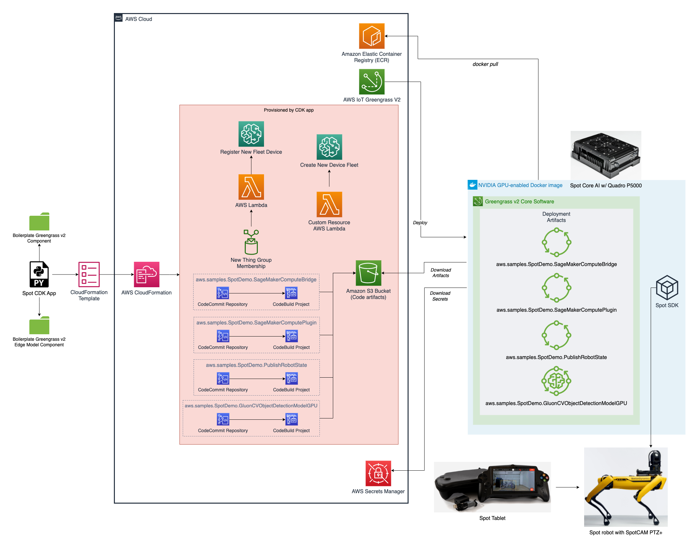
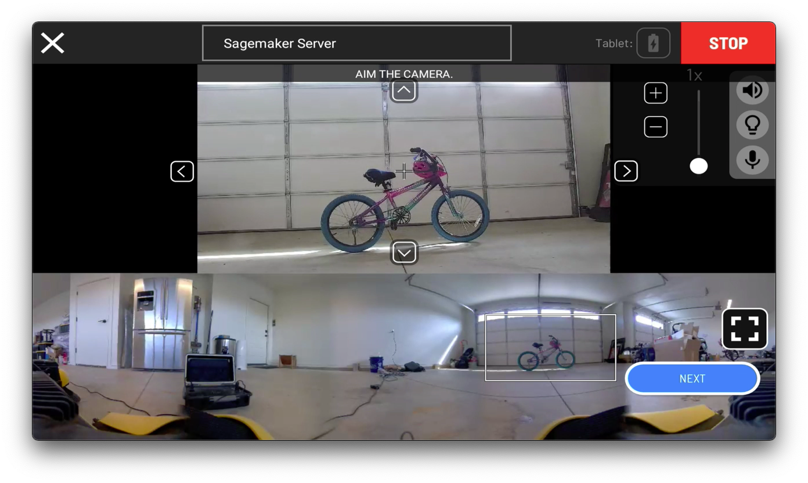

<!--
Copyright 2021 Amazon.com, Inc. or its affiliates. All Rights Reserved.
SPDX-License-Identifier: LicenseRef-.amazon.com.-AmznSL-1.0
Licensed under the Amazon Software License  http://aws.amazon.com/asl/
-->

# greengrass-v2-spot-robot-demo

## What is it?

The AWS Envision Engineering team has partnered with Boston Dynamics to create
a demo for deploying customer code and machine learning models to Spot®
robots. The objective of this demo is to demonstrate how AWS can bring
AI/ML applications to the edge, and help Spot identify objects of interest via the Spot
CAM+, a combination of a 360-degree and pan-tilt-zoom camera. Using SageMaker
to train object detection/image classification models (with built-in SageMaker
algorithms, or popular ML frameworks such as TensorFlow and PyTorch), the
models can then be optimized and packaged within a Greengrass v2 component, and deployed to the
edge to run on AWS IoT Greengrass. Greengrass will run on Spot Compute AI, a
hardened Linux-based computer that mounts to the back of the robot, and includes a
Nvidia P5000 GPU.

The demo is comprised of two major parts: 1) building/starting a Docker image for Spot that includes Greengrass, CUDA, and Nvidia drivers; and 2) a Python-based CDK application that
deploys all the resources necessary for Greengrass v2 components and associated repos/build pipelines, and SageMaker Edge Manager.

## High-level Architecture



## Assumptions

### Setup on Spot CORE / Spot CORE AI

```console
sudo usermod -aG docker $USER
sudo reboot
```

### AWS CLI setup

Ensure you have AWS CLI installed, a IAM user with an access key, and a named profile configured:

* [Installing, updating, and uninstalling the AWS CLI](https://docs.aws.amazon.com/cli/latest/userguide/cli-chap-install.html)
* [Configuration basics](https://docs.aws.amazon.com/cli/latest/userguide/cli-configure-quickstart.html)
* [Named profiles](https://docs.aws.amazon.com/cli/latest/userguide/cli-configure-profiles.html)
* [Minimum IAM policy required for deploying solution](minimum_ggv2_iam_policy.json)

### AWS CDK setup

* [Install the AWS CDK](https://docs.aws.amazon.com/cdk/latest/guide/getting_started.html#getting_started_install)

## Deploy supporting resources for Spot with CDK

### Setup virtual env

```console
cd spot_demo_cdk
python3 -m venv .venv
source .venv/bin/activate
python3 -m pip install -r requirements.txt
chmod +x package_lambdas_py3.sh
chmod +x deploy.sh
```

### Download and export ML model

This will download the 'ssd_512_mobilenet1.0_voc' pre-trained object detection from GluonCV Model Zoo, and create a model archive used for the demonstration. 

```console
python3 download_export_model.py
```

### Define Spot variables
> NOTE: This will be stored in AWS Secrets Manager, do not hard-code these variables in your application!
```console
export AWS_DEFAULT_PROFILE=<YOUR_AWS_NAMED_CLI_PROFILE>
export AWS_DEFAULT_REGION=<YOUR_AWS_REGION>
export SPOT_USER=<YOUR_SPOT_USERNAME>
export SPOT_PASSWORD=<YOUR_SPOT_PASSWORD>
export ROBOT_IP=<YOUR_ROBOT_IP_ADDRESS>
export THING_NAME=<YOUR_SPOT_ROBOT_NAME>
export TARGET=<cpu | spotcore_ai>
export SPOT_SDK_VERSION=<MAJOR.MINOR.PATCH>
```

### Deploy CDK app
```console
./deploy.sh
```

## Deploy to Spot

### Save password with ssh-copy-id
```console
ssh-copy-id -p 20022 spot@$ROBOT_IP
```

### Build image, create ECR repository (if necessary), and publish to ECR

#### Build for CPU target
```console
cd spot_container/
./publish-to-ecr-ssh.sh $AWS_DEFAULT_PROFILE spot $ROBOT_IP greengrass-v2-spot-robot-demo $TARGET $SPOT_SDK_VERSION
cd ..
```

#### ... or build for Spot CORE AI

1. Go to https://developer.nvidia.com/nvidia-tensorrt-download, and login (join if you don't have an account)
2. Click **TensorRT 7** under **Available Versions**
3. Check **I Agree** and click **TensorRT 7.2.1**
4. Download **TensorRT 7.2.1 for Ubuntu 18.04 and CUDA 10.2 TAR package** to the **spot_container** directory
5. You should now have **TensorRT-7.2.1.6.Ubuntu-18.04.x86_64-gnu.cuda-10.2.cudnn8.0.tar.gz** in **ggv2/container/gpu**, which is required for building the container

```console
cd spot_container/
./publish-to-ecr-ssh.sh $AWS_DEFAULT_PROFILE spot $ROBOT_IP greengrass-v2-spot-robot-demo $TARGET $SPOT_SDK_VERSION   
cd ..
```

### Start your Greengrass core device
> NOTE: running this the first time will automatically provision resources necessary to run Greengrass v2
>
> NOTE: edit this script to include restart policies to manage your Docker container after shutdown/reboot

#### Provision/start Greengrass on target device
```console
./run-ggv2-ssh.sh $AWS_DEFAULT_PROFILE spot $ROBOT_IP 20022 greengrass-v2-spot-robot-demo $TARGET $SPOT_SDK_VERSION $THING_NAME
```

### Create secrets

```console
aws secretsmanager create-secret --name spot_secrets --profile $AWS_DEFAULT_PROFILE
aws secretsmanager describe-secret --secret-id spot_secrets --profile $AWS_DEFAULT_PROFILE
aws secretsmanager put-secret-value --profile $AWS_DEFAULT_PROFILE --secret-id spot_secrets --secret-string "{\"spot_user\":\"$SPOT_USER\",\"spot_password\":\"$SPOT_PASSWORD\"}"
```

> NOTE: make sure to note the secret ARN. You'll need this later when configuring Greengrass.

### Update Token Exchange Service (TES) role
```console
aws iam attach-role-policy --profile $AWS_DEFAULT_PROFILE --role-name GreengrassV2TokenExchangeRole --policy-arn arn:aws:iam::aws:policy/AmazonS3ReadOnlyAccess
aws iam attach-role-policy --profile $AWS_DEFAULT_PROFILE --role-name GreengrassV2TokenExchangeRole --policy-arn arn:aws:iam::aws:policy/SecretsManagerReadWrite
```

## Configure and update deployment

To create a new Greengrass deployment with the custom components for Spot, run the following:

```console
python3 create_greengrass_deployment.py
```

## Running custom Greengrass v2 components on Spot

### Creating a new action

After logging onto Spot Tablet, navigate to Settings >> Actions.


Then tap **Create New Action**.


Under the prompt **Choose a template action**, select **SageMaker Server**, and tap **Create**.


Verify the message **The service [sagemaker-server] is currently registered and has no service faults**. Then select your image source - for example, **Spot CAM Image Service Ptz**. Finally, select a specific processing model (or tap **Choose Later** to select when performing the action). When completed, tap **Save**


Verify you have a new action named **SageMaker Server**.


### Executing the action


On the main Spot Tablet screen, tap the red action button in the bottom right corner.


Then, choose **SageMaker Server** as your action from the provided list.


Next, aim your camera at the area you'd like to capture and run inference on. Tap **Next**.


Then, select the model you'd like to use for inference - for example, **gluoncv-model**. Tap **Next**.


Finally, review the image capture and inference results. Tap **Create** to add metadata attributes and save as mission data.


## Security

See [CONTRIBUTING](CONTRIBUTING.md#security-issue-notifications) for more information.


## License

This repository is licensed under the MIT-0 License. See the LICENSE file.

This repository contains modified source code licensed under the Boston Dynamics Inc. ("Boston Dynamics") Software Development Kit License ([20191101-BDSDK-SL](https://github.com/boston-dynamics/spot-sdk/blob/master/LICENSE)). 